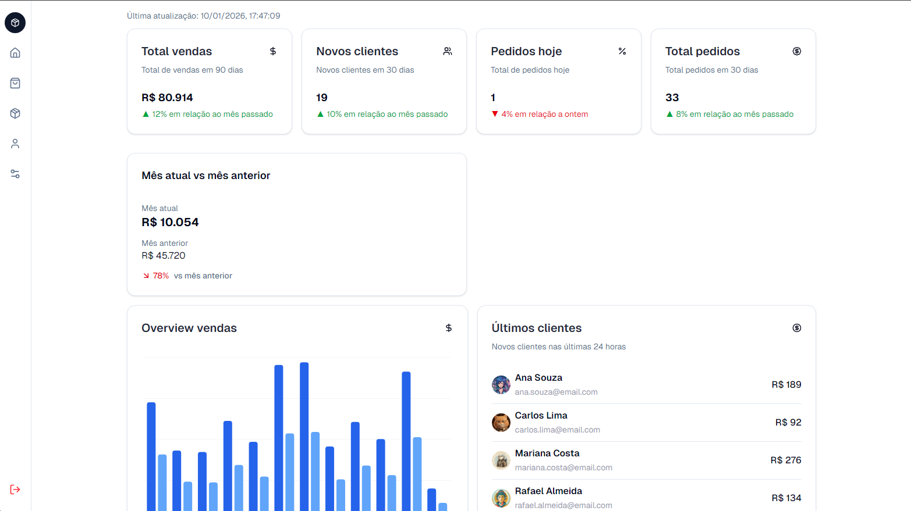
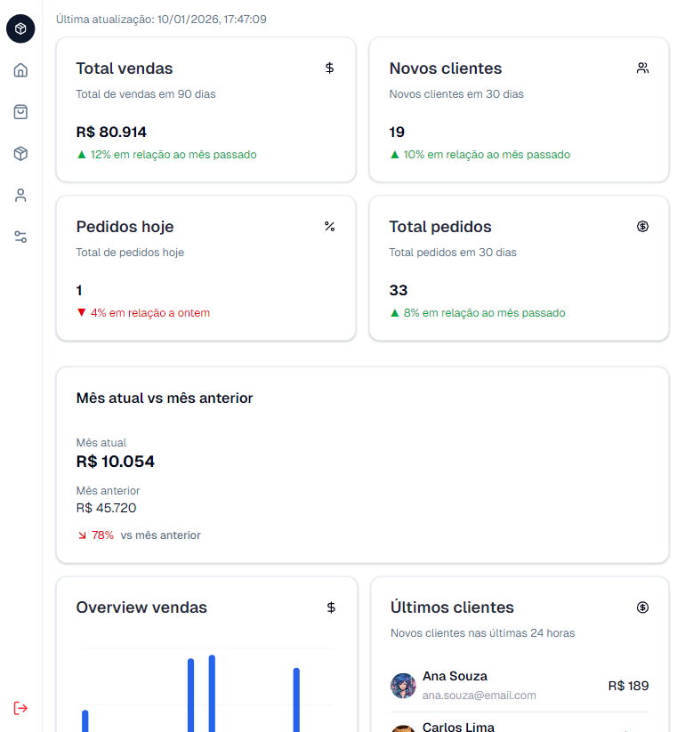
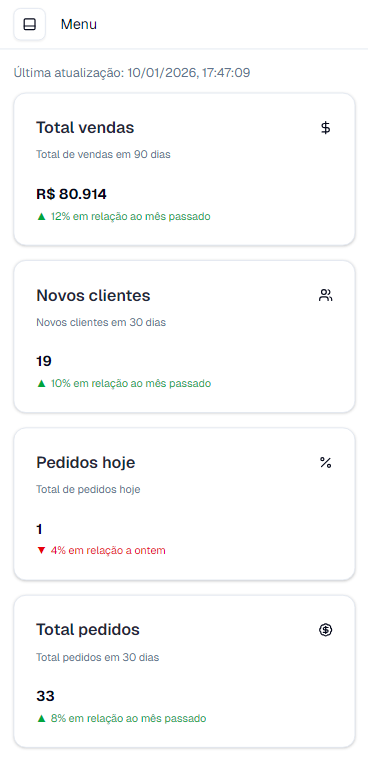
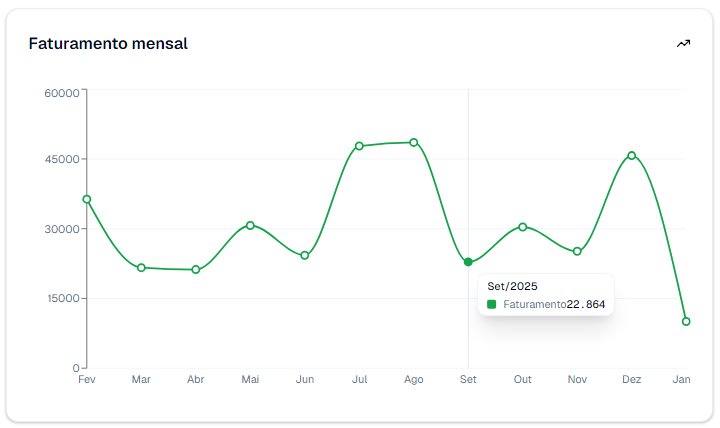
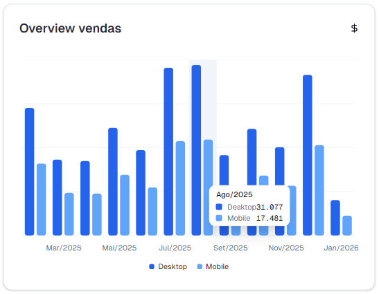
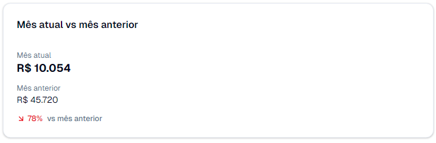

# **Dashboard Fullstack com Next.js, Prisma e PostgreSQL**



Um painel administrativo completo, construído para monitoramento de métricas de vendas, clientes e pedidos, usando **Next.js 16** no front-end e back-end, com **PostgreSQL + Prisma ORM** para persistência de dados, estilizado com **Tailwind CSS** e componentes **shadcn/ui**.

---

## 🔗 Links

- [Demo na Vercel](COLE_AQUI_O_LINK_DA_VERCEL)

---

## 🛠 Tecnologias utilizadas

- **Next.js 16 (App Router)** – Estrutura Fullstack e rotas API integradas.
- **React + TypeScript** – Componentes funcionais, tipagem segura e hooks (`useState`, `useEffect`).
- **Prisma ORM** – Modelagem de dados e consultas SQL de forma segura.
- **PostgreSQL** – Banco de dados relacional.
- **Tailwind CSS + shadcn/ui** – Layout responsivo, design moderno e componentes acessíveis.
- **Lucide-React** – Ícones consistentes no dashboard.
- **Radix Tooltip / Sheet** – Acessibilidade e usabilidade em menus e navegação lateral.
- **Recharts** – Gráficos dinâmicos de vendas.

---

## ⚡ Funcionalidades do Dashboard

1. **Métricas principais (Cards)**

   - Total de vendas dos últimos 90 dias
   - Pedidos do mês atual e do dia atual
   - Novos clientes nos últimos 30 dias
   - Crescimento do mês atual em comparação com o anterior

2. **Comparativo Mês Atual x Mês Anterior**

   - Valor total de vendas do mês atual até o dia de hoje
   - Valor total do mês anterior (completo)
   - Crescimento percentual do mês

3. **Gráfico de vendas mensais (Rolling 12 meses)**

   - Últimos 12 meses (dinâmico conforme o mês atual)
   - Separação de vendas entre **desktop** e **mobile**
   - Exibição de mês/ano (ex: Fev/2025 → Jan/2026)

4. **Seed de dados realista**

   - Pedidos mensais com ticket médio entre R$120 e R$1.500
   - Clientes distribuídos nos últimos 6 meses
   - Facilita testes e visualização real do dashboard

5. **Menu lateral responsivo**

   - Ícones para Dashboard, Pedidos, Produtos, Clientes e Configurações
   - Tooltips acessíveis e menu mobile com **Sheet** do Radix

6. **Acessibilidade**

   - Todos os elementos interativos com `sr-only`
   - Tooltips e Sheet compatíveis com leitores de tela

---

## 📸 Screenshots

### Tela principal Desktop


### Tela principal Tablet



### Tela principal Mobile



### Gráfico de vendas mensais




### Comparativo mês atual x mês anterior



---

## 💻 Estrutura do projeto

```
/app
├─ /api/dashboard        -> API para métricas e gráficos
├─ page.tsx              -> Página principal do dashboard

/src
├─ /components
│  ├─ ChartOverview.tsx
│  ├─ ChartTotal.tsx
│  ├─ MetricCard.tsx
│  ├─ MonthComparisonCard.tsx
│  ├─ Sales.tsx
│  ├─ SideBar.tsx
│  └─ ui/*                -> Componentes shadcn/ui
├─ /lib
│  └─ prisma.ts           -> Cliente Prisma
├─ /data
│  └─ dashboard-cards.ts  -> Configuração dos cards do dashboard
└─ /types
   └─ dashboard.ts        -> Tipagem TypeScript das métricas e gráficos
```

---

## 🚀 Diferenciais

- Rotas API integradas ao front-end com **Next.js App Router**
- Dashboard dinâmico que ajusta o gráfico conforme o mês atual
- Componentes acessíveis e responsivos, pronto para desktop e mobile
- Seed de dados realista para testes sem precisar de back-end real
- Integração fácil com PostgreSQL usando Prisma

---

## 📈 Resultado

- Visualização clara das métricas de vendas, pedidos e clientes
- Comparativos entre meses e crescimento percentual
- Gráfico rolling 12 meses atualizado automaticamente
- Dashboard completo e funcional pronto para produção
